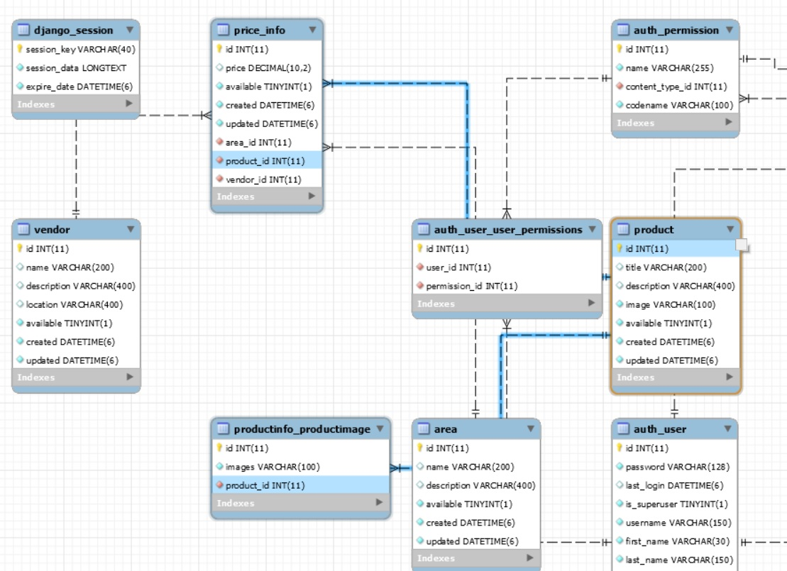
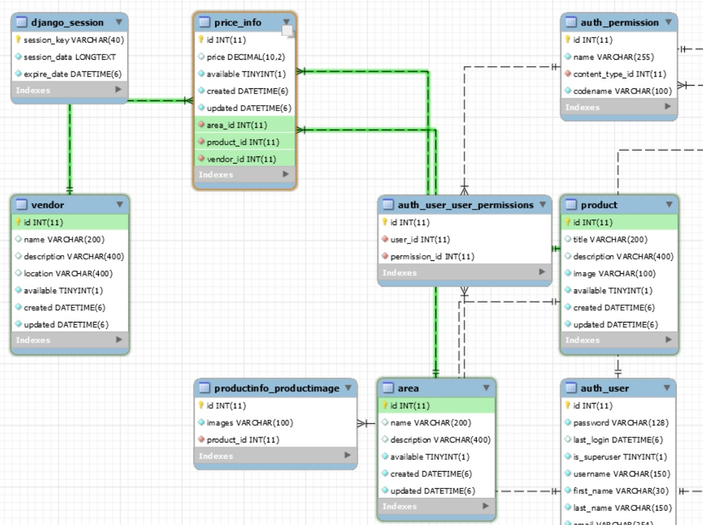
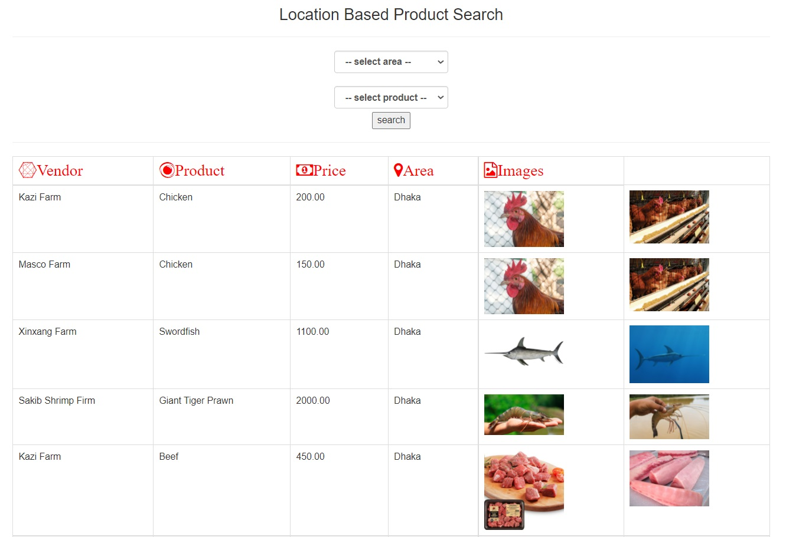
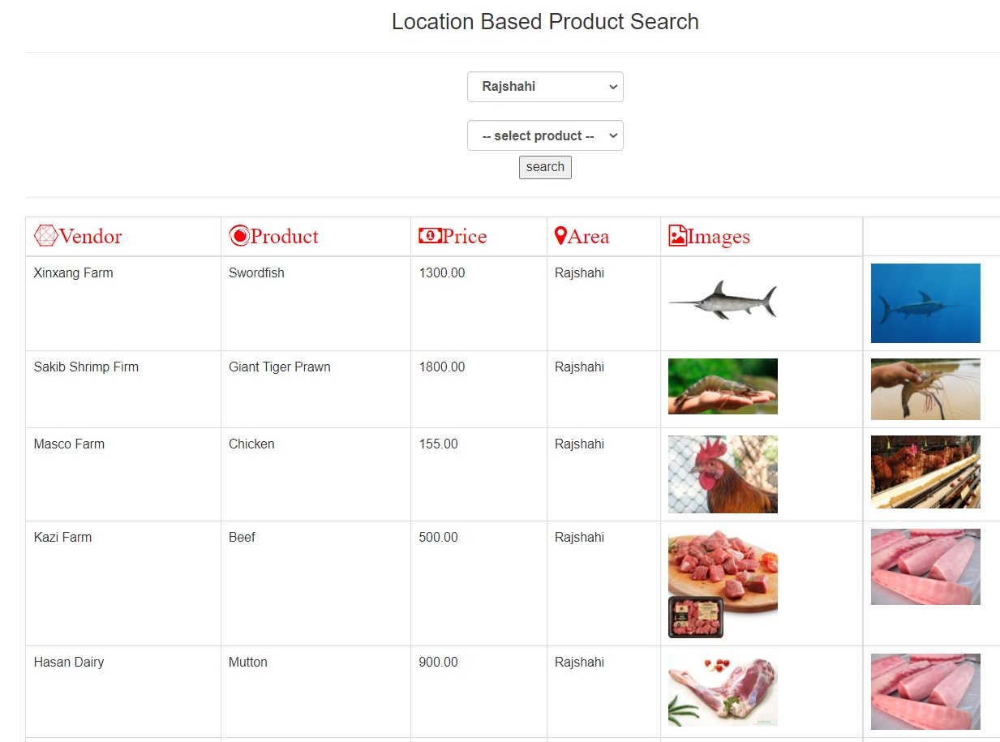
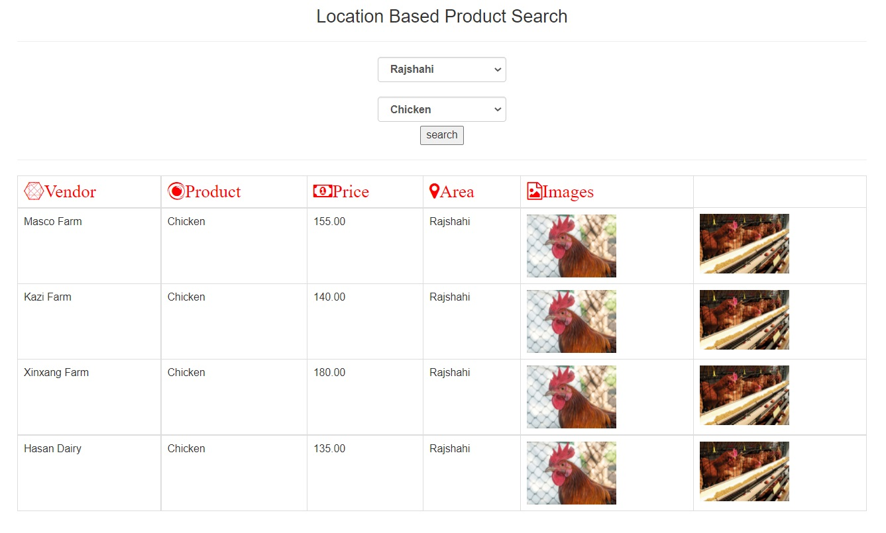
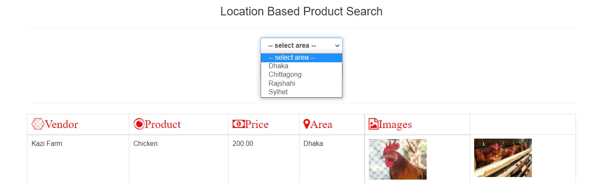
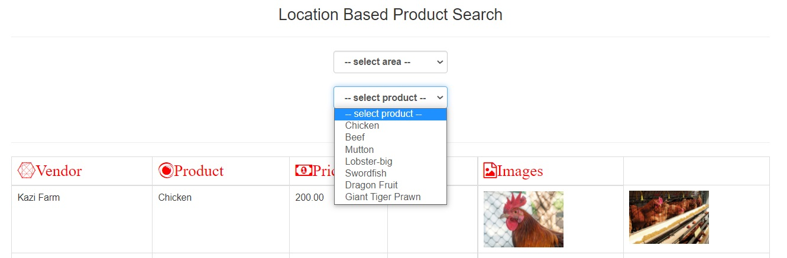
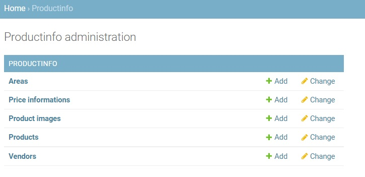
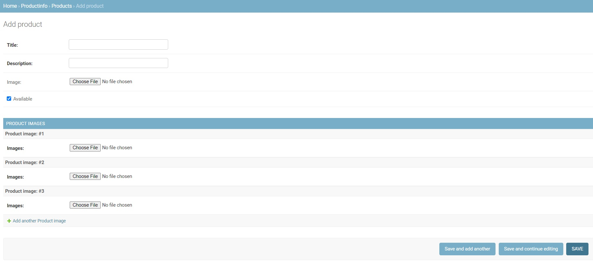

# LocationBasedSearch-django
Location based product price search.
Final outcome: Area based product search, where multiple vendor's are provide their specific product price.

# DB-Architechture

# DBScreenshot1

# DBScreenshot2

# Frontend

# Screenshot1
public page without any search operation

# Screenshot2
Area wise all vendor's product search

# Screenshot3
Area wise all vendor's specific product search

# Screenshot4
Area wise dropdown info

# Screenshot5
product wise dropdown info

# Admin-Panel

# AdminPanelScreenshot1
All model's info

# AdminPanelScreenshot2
Product model page with ProductImage model, where multiple images can upload for same product

